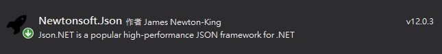

# INI_db.cs

## Install

`INI_db.cs` is base on `ini-parser` & `Newronsoft.json`, so you must add they to your project by nuget manager.




https://www.nuget.org/packages/ini-parser/

https://www.nuget.org/packages/Newtonsoft.Json/

Then you can import `INI_db.cs` with `Join existing item` .

## How To Use

### Save parameters

```c#
INI_db db_tool = new INI_db();           
string db_path = "db.ini";

// save example
db_tool.Save(db_path, "Group1", "Boolean", true);
db_tool.Save(db_path, "Group1", "Integer", 100);
db_tool.Save(db_path, "Group1", "Float", 123.321);
db_tool.Save(db_path, "Group1", "String", "Hello");
```

And you can get files`db.ini` like below

```ini
[Group1]
Boolean = True
Integer = 100
Float = 123.321
String = Hello
```

### Load Parameters

By this method a preset value can be specified when reading parameters. Avoid parameter does not exist.

```C#
INI_db db_tool = new INI_db();
string db_path = "db.ini";

int value_default = 123;
System.Console.WriteLine("data = {0}", db_tool.Load(db_path, "Group1", "Integer", value_default)); // data = 100
System.Console.WriteLine("data = {0}", db_tool.Load(db_path, "Group1", "Integer_1", value_default)); // data = 123
```

Or try to load method by this way.

```c#
double oValue;
if (db_tool.TryLoad(db_path, "Group1", "Float", out oValue))
    Console.WriteLine($"Load Success, data = {oValue}"); // Load Success, data = 123.321
else
    Console.WriteLine("Load Failed");
```

### The amount of data is a little big?

It takes a lot of time because of repeated reading and writing file... But you can modify data before save the db file `data.ini` by below method.

```c#
// Save DB
Random rand = new Random();

int k_group_num = 50; // 50x100
int k_para_num = 100;
var db_mem = new IniData();
for (int idx_group = 0; idx_group < k_group_num; idx_group++)
{
    for (int idx_para = 0; idx_para < k_para_num; idx_para++)
    {
        db_tool.Insert(db_mem, $"Group_{idx_group}", $"Value_{idx_para}", rand.NextDouble());
    }
}
db_tool.Save("data.ini", db_mem);
```

Also you can get data after load the db file `data.ini` by below method.

```c#
// Load DB
var db_mem = db_tool.Load("data.ini");
for (int idx_group = 0; idx_group < k_group_num; idx_group++)
{
    for (int idx_para = 0; idx_para < k_para_num; idx_para++)
    {
        double f_value;
        //db.TryLoad(db_mem, $"Group_{idx_group}", $"Value_{idx_para}", out f_value);
        f_value = db_tool.Load(db_mem, $"Group_{idx_group}", $"Value_{idx_para}", 0.0);
    }
}
```

### How about json?

You can save json to `json.ini` by this method.

```c#
INI_db db_tool = new INI_db();

dynamic json_data = new JObject();
json_data.Boolean = false;
json_data.Integer = 200;
json_data.Float = 234.567;
json_data.String = "Hello World";
json_data.Array = new JArray(1, 2, 3, 4, 5);

db_tool.Save("json.ini", "Group1", "Json", json_data);
```

The `json.ini` file will look like this:

```ini
[Group1]
Json = {"Boolean":false,"Integer":200,"Float":234.567,"String":"Hello World","Array":[1,2,3,4,5]}
```

Load json from `json.ini`

```c#
JObject j_default = new JObject();
JObject j = db_tool.Load("json.ini", "Group1", "Json", j_default);
Console.WriteLine("json_value = {0}", j.ToString());
```


# _(┐「ε:)__

