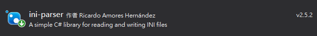

# INI_db.cs

## Install

`INI_db.cs` is base on `ini-parser`, so you must add ini-parser to your project by nuget manager.



https://www.nuget.org/packages/ini-parser/

Then you can import `INI_db.cs` with `Join existing item` .

## How To Use

### Save parameters

```cs
// db
INI_db db = new INI_db();           
string db_path = "db.ini";

db.Save(db_path, "Group1", "Boolean", true);
db.Save(db_path, "Group1", "Integer", 100);
db.Save(db_path, "Group1", "Float", 123.321);
db.Save(db_path, "Group1", "String", "Hello");
```

And you can get files`db.ini` like below

```ini
[Group1]
Boolean = True
Integer = 100
Float = 123.321
String = Hello
```

### Load Parameters

By this method a preset value can be specified when reading parameters. Avoid parameter does not exist.

```csharp
// db
INI_db db = new INI_db();
string db_path = "db.ini";

System.Console.WriteLine("data = {0}", db.Load(db_path, "Group1", "Integer", value_default));
System.Console.WriteLine("data = {0}", db.Load(db_path, "Group1", "Integer_1", value_default));

//data = 100
//data = 123
```

Or try to load like this method

```c#
double oValue;
if (db.TryLoad(db_path, "Group1", "Float", out oValue))
    Console.WriteLine($"Load Success, data = {oValue}");
else
    Console.WriteLine("Load Failed");
```


